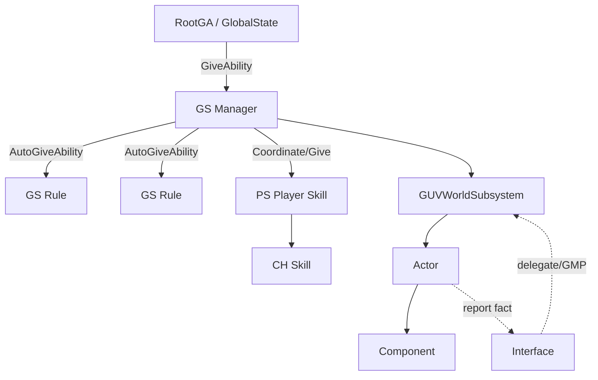
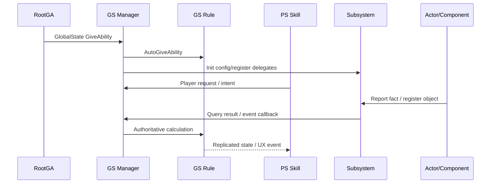

# GameUniverse 需求分析与技术实现报告模板

## 0. 结论先行

- 推荐方案：
- 方案等级：需求分析 / 技术方案 / 待实现 / 已实现
- Root/GUV 归属：
- 主要改动层级：Root / GS Manager / GS Rule / PS / CH / Subsystem / Actor / Component / Config
- 最大风险：
- 验证结论：

## 1. 需求复述

- 目标玩法 / 系统：
- 所属模式：
- 玩家体验目标：
- 旧流程兼容要求：
- 明确不做：
- 当前假设：

## 2. 资料与证据

| 类型 | 路径 / 来源 | 结论 |
|---|---|---|
| 需求文档 |  |  |
| Root / Config |  |  |
| 现有代码 |  |  |
| 既有系统类比 |  |  |
| 规则 / 记忆 |  |  |

## 3. Root 阶段与系统入口

| 项 | 结论 | 证据 / 说明 |
|---|---|---|
| RootGA |  |  |
| Give / Activate 时机 |  |  |
| GlobalState Action |  |  |
| 涉及常规 State |  |  |
| 阶段切换条件 |  |  |
| DebugDA 覆盖点 |  |  |

## 4. GameUniverse 技能拓扑

| 层级 | 类型 / 命名 | 职责 | 是否权威 | 备注 |
|---|---|---|---|---|
| Root |  |  |  |  |
| GS Manager |  |  | 是 |  |
| GS Rule |  |  | 是 |  |
| PS |  |  | 否 / 请求方 |  |
| CH |  |  | 否 / 角色生命周期 |  |
| Subsystem |  | 服务/查询/注册 | 视职责 |  |
| Actor |  |  | 服务端状态权威 |  |
| Component |  |  | 视职责 |  |
| Interface |  | 事实上报/适配 | 否 |  |

## 5. 配置与数据结构

| 配置 / 数据 | 放置位置 | 字段建议 | 原因 |
|---|---|---|---|
| 总开关 | RootGAConfig / SubsystemConfig |  |  |
| 模块开关 | SubsystemConfig / Manager Config |  |  |
| 规则参数 | Rule Config |  |  |
| 玩家状态 Tag | PlayerExInfoTags / PS Config |  |  |
| 调试覆盖 | DebugDA |  |  |
| 运行时状态 | GS / Actor replicated state |  |  |
| 事件快照 | replicated snapshot / event struct |  |  |

## 6. 玩家、队伍、阵营、关系

- `PlayerExInfo`：
- `PlayerExInfoTags`：
  - 写入方：
  - 读取方：
  - 生命周期：
  - 清理时机：
- `TeamExInfo`：
- `CampExInfo`：
- `GUVRelationSubsystem`：
  - 敌友判断：
  - 模式差异：
  - 禁止硬编码点：

## 7. 运行时流程

## 8. 专项方案

### 8.1 异常 / 区域 / 事件 / 奖励系统

- 区域数据：
- 烘焙资产：
- 空间查询：
- 外部模块适配：
- 事件生成：
- 奖励发放：
- 关闭系统后的旧流程：

### 8.2 绳索 / 运输 / 联机 Actor 系统

- 推荐运动方案：
- 绳索松弛 / 拉紧规则：
- 障碍检测：
- 断绳快照：
- 客户端平滑：
- 玩家 3C 保护：
- 净化 / 投递 / 奖励：

## 9. 实现计划

| 步骤 | 文件 / 类 / 配置 | 改动内容 | 风险 | 验证 |
|---|---|---|---|---|
| 1 | Root / Config |  |  |  |
| 2 | GS Manager |  |  |  |
| 3 | GS Rule |  |  |  |
| 4 | PS / CH |  |  |  |
| 5 | Subsystem |  |  |  |
| 6 | Actor / Component / Interface |  |  |  |
| 7 | Replication / Debug |  |  |  |

## 10. 兼容、风险与回滚

| 风险 | 影响 | 规避方案 | 回滚方式 |
|---|---|---|---|
| 权威层放错 |  |  |  |
| 配置分散 |  |  |  |
| Relation 硬编码 |  |  |  |
| DS / Editor 差异 |  |  |  |
| 网络同步抖动 |  |  |  |
| 旧流程被影响 |  |  |  |

## 11. 验证步骤

1. Editor：切换目标 RootGA，使用 DebugDA 缩短阶段并验证流程。
2. Root：验证 GlobalState GiveAbility、Manager Activate、Rule AutoGiveAbility 顺序。
3. Config：验证 RootGAConfig、SubsystemConfig、ManagerConfig、RuleConfig 加载。
4. 玩家：验证 PostLogin、InitializePlayer、PlayerExInfoTags 写入/清理。
5. 关系：验证队伍、阵营、敌友关系由 GUVRelationSubsystem 或配置驱动。
6. DS：检查 DS log，确认包体初始化差异可解释。
7. 网络：验证服务端权威、OnRep、快照、客户端平滑、重连。
8. 开关：验证系统关闭、单模块关闭、DebugDA 禁用 Action 后旧流程不受影响。
9. 回归：验证结算、复活、OB/Replay、Loot/Monster/Mission 等相关流程。
