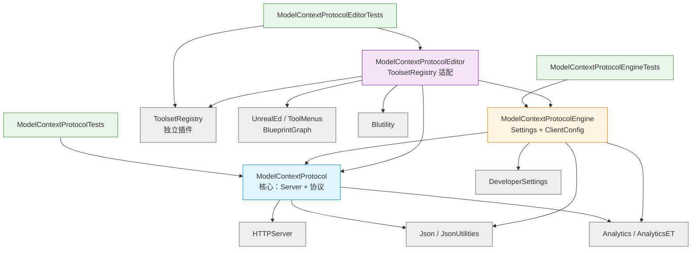

# 01 — 模块拓扑

## 模块清单

`ModelContextProtocol.uplugin:19-49` 声明了 6 个模块，按层次划分：

| 模块 | Type | LoadingPhase | 职责 | 行数（cpp） |
|---|---|---|---|---|
| `ModelContextProtocol` | Runtime | Default | 协议核心：HTTP+SSE Server、JSON-RPC 路由、Tool/Resource 抽象、Analytics | ~1660 |
| `ModelContextProtocolEngine` | Runtime | Default | 引擎集成：UDeveloperSettings、ClientConfig 生成、（已弃用的）BlueprintFunctionLibrary→Tool 桥 | ~700 |
| `ModelContextProtocolEditor` | Editor | Default | 编辑器集成：ToolsetRegistry 适配器、auto-start、deprecated 资产定义 | ~791 |
| `ModelContextProtocolTests` | UncookedOnly | Default | 协议核心单元测试 | ~多文件 |
| `ModelContextProtocolEngineTests` | UncookedOnly | Default | 引擎层单元测试（ClientConfig） | ~多文件 |
| `ModelContextProtocolEditorTests` | Editor | Default | Editor 层单元测试（ToolsetRegistry adapter 等） | ~843 |

> Type 解读：`Runtime` 在所有 Target 编译，`Editor` 只在编辑器 Target 编译，`UncookedOnly` 只在 development/编辑器 Target 编译且不打入 shipping 包。

## 模块依赖图

依赖来源：各模块的 `.Build.cs` 文件（核心：`ModelContextProtocol.Build.cs:11-26`；引擎：`ModelContextProtocolEngine.Build.cs:11-39`；编辑器：`ModelContextProtocolEditor.Build.cs:11-42`）。

## 三层架构语义

### 1. `ModelContextProtocol`（**核心，Runtime**）

**功能完整、可独立工作**。如果只需要在 Runtime 里启个 MCP server 给 LLM 提供运行时 Tool（例如调试用控制台），单这一层就够：调 `IModelContextProtocolModule::Get()->StartServer()` 然后 `AddTool()`。

唯一对外的 UObject 较少（`FModelContextProtocolSession.generated.h` 里的几个 USTRUCT 仅用于 JSON 序列化），所以 cook 后体积小。

### 2. `ModelContextProtocolEngine`（**便利层，Runtime**）

把"散装"的 MCP 接口包装成 Unreal 风格：
- `UModelContextProtocolSettings`：Editor → Project Settings → Plugins → Model Context Protocol，里面调 `bAutoStartServer / ServerPortNumber / ServerUrlPath`。
- `ClientConfig` 工具：一行 console command 帮你写好 `.mcp.json / .cursor/mcp.json / .vscode/mcp.json / .gemini/settings.json / .codex/config.toml`，省去手写。
- **被废弃的便利层**：`UModelContextProtocolToolLibrary` 和 `UModelContextProtocolToolAsyncAction` 允许把 `UBlueprintFunctionLibrary` 的每个 `UFUNCTION` 自动暴露成 MCP Tool。两者都被显式标注 `DeprecatedNode → "Use UToolsetDefinition (ToolsetRegistry plugin) instead."`（见 `ModelContextProtocolToolLibrary.h:29-33`、`ModelContextProtocolToolAsyncAction.h:20-23`）。

### 3. `ModelContextProtocolEditor`（**编辑器集成，Editor-only**）

把 **ToolsetRegistry** 插件里的 Toolset 适配成 MCP Tool，是**当前 Epic 推荐的工具来源**。两种模式（CVar `ModelContextProtocol.DeferredToolLoading`，默认开）：

- **Eager**：所有 Toolset 的所有 tool 在 PostEngineInit 一次性 `AddTool`，简单粗暴。
- **Deferred**（默认）：只注册 3 个发现/加载工具 `list_toolsets / describe_toolset / load_toolset`，让 LLM 按需载入。这是为了**避免一次性把几十个工具描述塞进 context window**。

同时这一层在 `SetupEditorIntegration()` 里完成 **auto-start**：如果设置/命令行打开了 `bAutoStartServer`，就启动 HTTP server（`ModelContextProtocolEditor.cpp:63-70`）。

## 可裁剪性

| 你要做的 | 需要哪些模块 |
|---|---|
| 编辑器装好就用，对接 Claude Code 等 | 全部默认 |
| 只想在 Runtime 里跑（dedicated server / shipping dev build） | 仅 `ModelContextProtocol` + `ModelContextProtocolEngine`；Editor 模块不会打入非编辑器 target |
| 完全脱离 ToolsetRegistry 自己 AddTool | 用 `ModelContextProtocol` + `ModelContextProtocolEngine`，**不要启用 Editor 模块的 auto-start**（或自己注册时调 `Module->StartServer()`）|
| 只读插件源码做参考、不跑插件 | 只读 `ModelContextProtocol`（Public 头 + Server.cpp）就够 |
