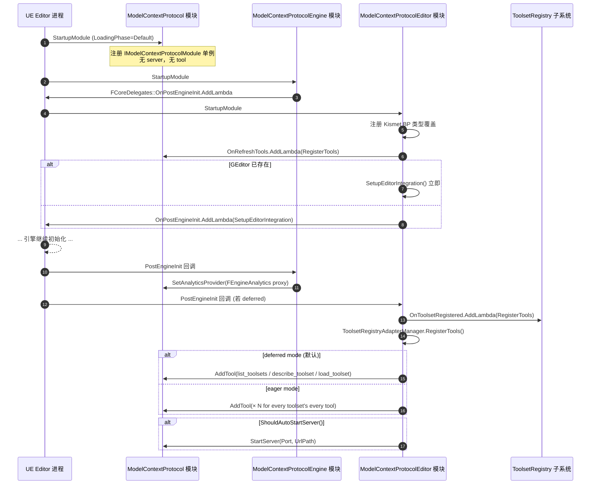
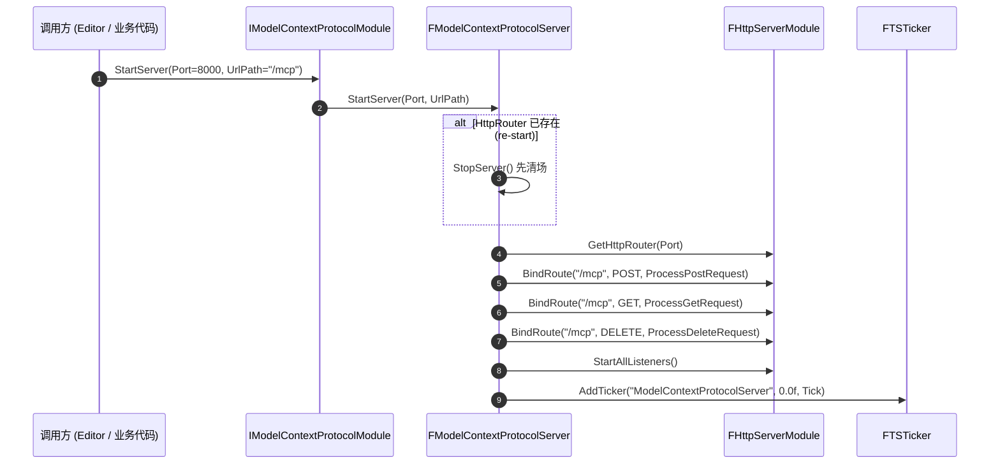
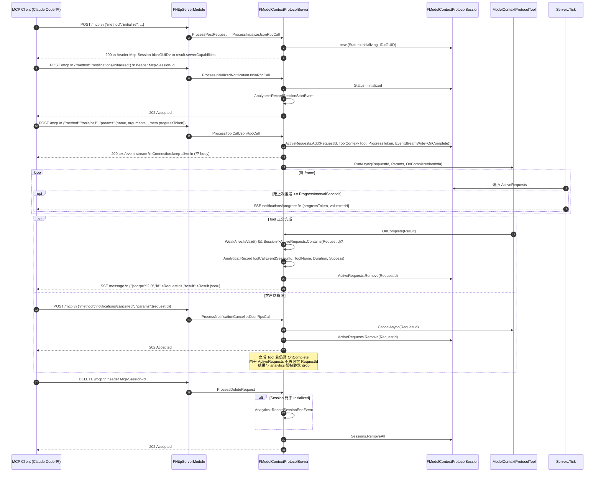

# 05 — 启动与运行时时序

把零散的"哪个回调在什么时候被谁触发"串起来。三张图：模块加载 → 服务启动 → `tools/call` 全流程。

## 1. 模块加载（Editor target）

来源：`ModelContextProtocolEditor.cpp:17-71`、`ModelContextProtocolEngineModule.cpp:75-129`、`ModelContextProtocolToolsetRegistryAdapter.cpp:138-211`。

## 2. `StartServer` 内部

源码：`ModelContextProtocolServer.cpp:388-419`。

## 3. `tools/call` 完整流程（含 SSE 与 cancel）

源码定位：
- POST 处理与分发：`ModelContextProtocolServer.cpp:497-611`
- `initialize`：`:622-656`；`notifications/initialized`：`:658-682`
- `tools/call`：`:779-920`（SSE 设置在 `:863-869`，异步 callback 在 `:871-917`）
- progress Tick：`:1012-1042`
- cancel：`:684-730`
- DELETE：`:1056-1095`

## 4. ShutdownModule 倒序

Editor 模块 `ShutdownModule`（`ModelContextProtocolEditor.cpp:73-88`）：
1. 解除 `OnRefreshTools` 订阅
2. 解除 `OnToolsetRegistered` 订阅
3. `ToolsetRegistryAdapterManager.DeregisterTools()` —— `Module->RemoveTool` 所有 adapter

Engine 模块 `ShutdownModule`（`ModelContextProtocolEngineModule.cpp:86-106`）：
1. 解除 `PostEngineInit` 订阅
2. 如果当前 analytics provider 还是自己装的 proxy，调 `SetAnalyticsProvider(nullptr)` 清理。第三方覆盖过则不动。

核心模块 `ShutdownModule` 里 `StopServer()`（`:421-462`）：
- 对每个 `Initialized` 状态的 Session 发 `SessionEnd`
- `RemoveTicker`、`UnbindRoute`、`HttpRouter.Reset()`
- 不主动通知任何活跃 SSE 流——`AliveGuard` 自然失效，后续 callback 被 weak ptr 守住
